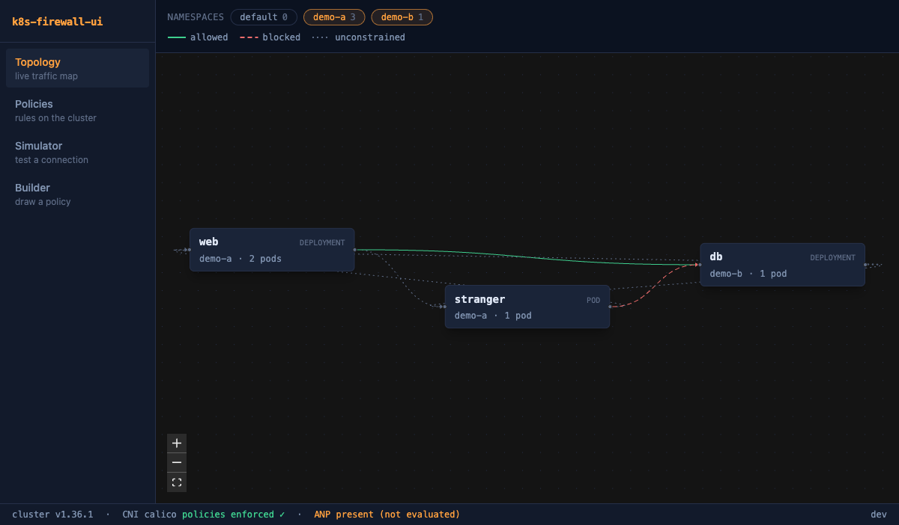
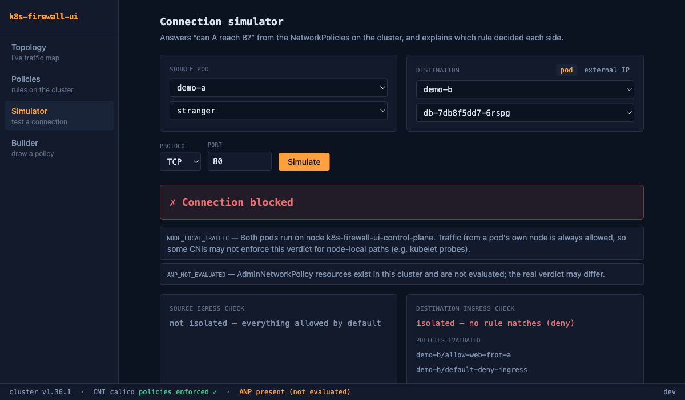
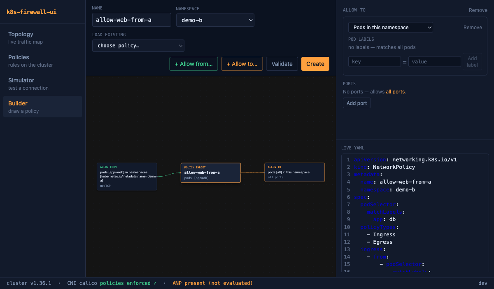

# k8s-firewall-ui

**A visual firewall dashboard for Kubernetes NetworkPolicies** — view, create, edit, simulate, and manage network policies on a live cluster.

> No open-source tool combines a live-cluster view, a visual policy builder, apply/CRUD, and connection simulation — that combination only exists in commercial products. k8s-firewall-ui fills the gap: CNI-agnostic, self-hosted, Apache-2.0.



## Features

- 🗺️ **Topology viewer** — live graph of workloads with policy-derived edges: green = allowed by policy, red = blocked, dotted = no policy applies. Click an edge to see which policies decide it.
- ✏️ **Policy management** — list, inspect (human-readable rule rendering), create, edit (form + YAML), and delete NetworkPolicies. Every change can be validated with a server-side dry-run first; concurrent edits are detected via resourceVersion.
- 🧪 **Connection simulator** — "can pod A reach pod B on port 5432?" answered from the policy set, with the exact rule that allowed or denied each side and links to the policies.

  

- 🧱 **Visual builder** — compose a policy on a canvas: peer cards flow into the target (ingress) or out of it (egress); separate cards are OR, an AND lives inside one card — the #1 NetworkPolicy authoring mistake, made visible. Live YAML preview as you build.

  

- 🚨 **CNI awareness** — detects your CNI (Calico, Cilium, Antrea, flannel, …) and warns loudly when policies are silently unenforced (plain flannel, VPC CNI without the policy agent). Detects AdminNetworkPolicy CRDs and tells you results may be incomplete.
- ⚠️ **Built-in guardrails** — warnings for the DNS egress trap (default-deny egress breaks DNS), hostNetwork pods (selectors don't match them), and node-local traffic bypass.

## Quickstart

### Local mode (against your kubeconfig)

```bash
git clone https://github.com/ismoilovdevml/k8s-firewall-ui.git
cd k8s-firewall-ui
make run
# open http://localhost:8080
```

Requirements: Go 1.26+, Node 22+, a kubeconfig pointing at a cluster.

### In-cluster (Helm)

```bash
helm install firewall-ui deploy/helm/k8s-firewall-ui
kubectl port-forward svc/firewall-ui-k8s-firewall-ui 8080:8080
```

Set `readOnly: true` to deploy without write permissions (the ClusterRole drops the write verbs and the binary rejects mutations).

### Docker

Prebuilt multi-arch images (amd64/arm64) are published to GHCR on every release:

```bash
docker run --rm -p 8080:8080 -v ~/.kube/config:/kubeconfig:ro \
  ghcr.io/ismoilovdevml/k8s-firewall-ui:latest --kubeconfig /kubeconfig
```

Or build locally:

```bash
docker build -t k8s-firewall-ui .
```

Release binaries for Linux and macOS are attached to [GitHub Releases](https://github.com/ismoilovdevml/k8s-firewall-ui/releases).

## How the simulator works

The engine is a pure function over an informer-cache snapshot, implementing the NetworkPolicy spec exactly: a connection is allowed iff the source's egress check AND the destination's ingress check both pass; a pod is default-allow until a policy selects it for that direction, then default-deny plus the union of matching rules. Peer AND/OR structure, `ipBlock` with `except`, named ports, `endPort` ranges, and empty-vs-missing rule lists are all covered by a table-driven test matrix, and verdicts are spot-checked against real Calico enforcement in CI-adjacent testing. See [docs/research/network-policy-semantics.md](docs/research/network-policy-semantics.md) for the semantics reference.

## Development

```bash
make dev              # backend on :8080
cd web && npm run dev # frontend on :5173, /api proxied to :8080
make test test-web    # Go + vitest suites
```

A local test cluster with real policy enforcement:

```bash
kind create cluster --name k8s-firewall-ui --config hack/kind-config.yaml
kubectl create -f https://raw.githubusercontent.com/projectcalico/calico/v3.29.1/manifests/calico.yaml
```

Architecture and conventions: [CLAUDE.md](CLAUDE.md) · API reference: [docs/api.md](docs/api.md)

## Status

v0.1 — all core features implemented (topology, CRUD, simulator, builder, Helm/Docker/CI). Roadmap: token login with per-user RBAC, OIDC, AdminNetworkPolicy evaluation once the API reaches beta, policy generation from observed traffic.

## License

[Apache-2.0](LICENSE)
