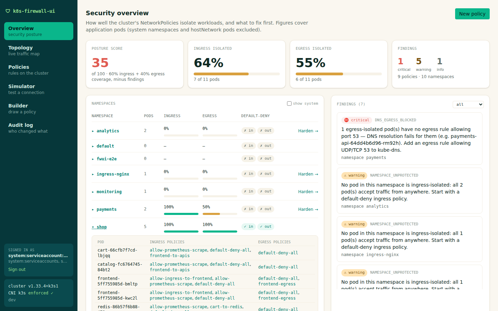
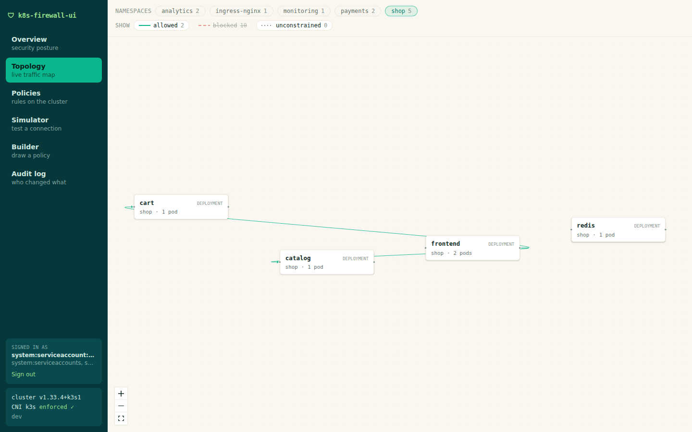
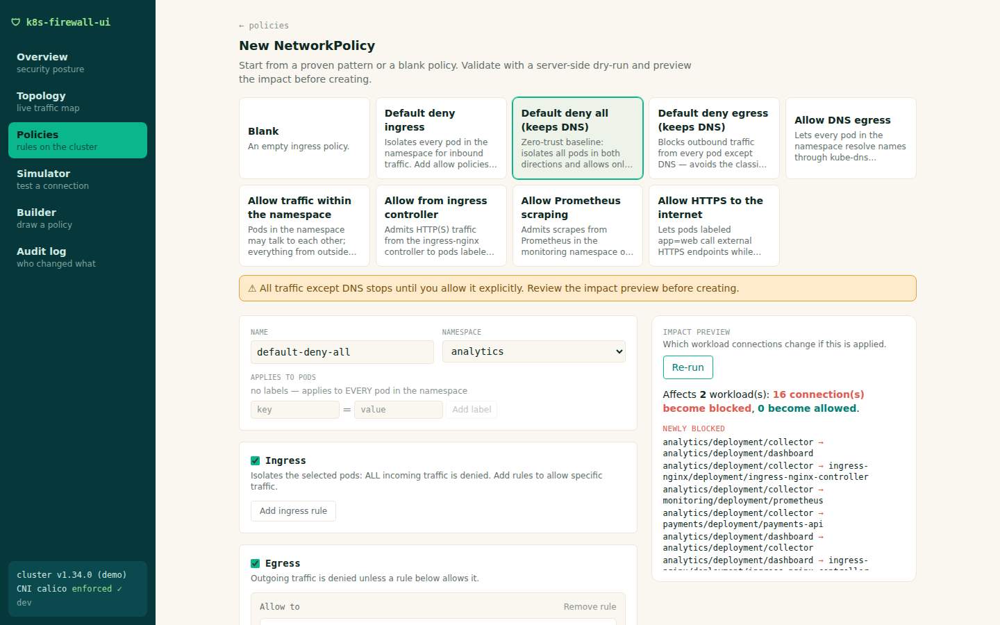
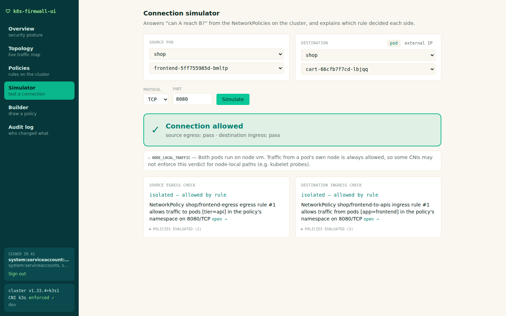
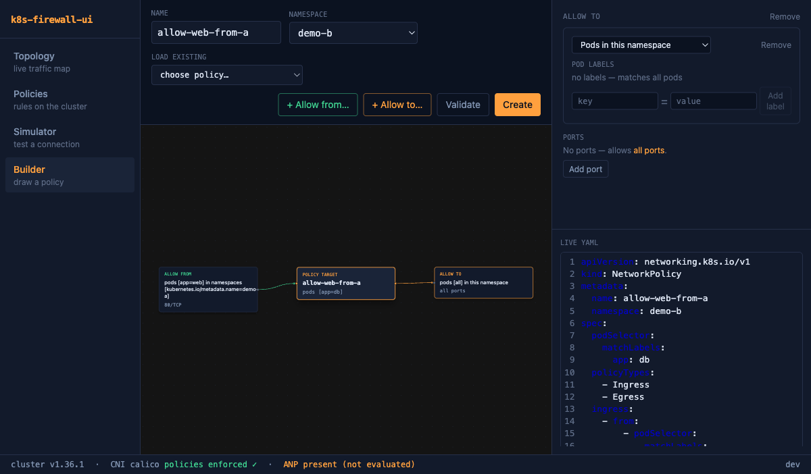

# k8s-firewall-ui

**A visual firewall dashboard for Kubernetes NetworkPolicies** — view, create, edit, simulate, and manage network policies on a live cluster.

> No open-source tool combines a live-cluster view, a visual policy builder, apply/CRUD, and connection simulation — that combination only exists in commercial products. k8s-firewall-ui fills the gap: CNI-agnostic, self-hosted, Apache-2.0.


*A 55-second tour recorded by the Playwright suite against a real k3s cluster ([MP4](docs/media/walkthrough.mp4)).*

## Features

- 🛡️ **Security overview**: a posture score, ingress/egress isolation coverage per namespace, and prioritized findings. Findings include egress isolation that breaks DNS, selectors with label typos that match nothing, allow-all rules, `0.0.0.0/0` ingress, policies that select no pods, and unprotected namespaces. One click hardens a namespace with a default-deny baseline.

  

- 🗺️ **Topology viewer**: a live graph of workloads with policy-derived edges. Green means allowed by policy, red means blocked, dotted means no policy applies. Filter by verdict, and click an edge to see which policies decide it.

  

- ✏️ **Policy management**: list, inspect (human-readable rule rendering), create, edit (form + YAML), and delete NetworkPolicies. Every change can be validated with a server-side dry-run first, and concurrent edits are detected via resourceVersion.
- 🔮 **Impact preview**: before you create, edit or delete a policy, see exactly which workload-to-workload connections become blocked or allowed.
- 📚 **Templates**: start from proven patterns such as default-deny (DNS kept open), allow DNS, same-namespace, ingress controller, Prometheus scraping, and HTTPS egress.

  

- 🧪 **Connection simulator**: answers "can pod A reach pod B on port 5432?" from the policy set, with the exact rule that allowed or denied each side and links to the policies.

  

- 🧱 **Visual builder**: compose a policy on a canvas. Peer cards flow into the target (ingress) or out of it (egress). Separate cards are OR, and an AND lives inside one card, which makes the #1 NetworkPolicy authoring mistake visible. The YAML preview updates live as you build.

  

- 📦 **GitOps-friendly import/export**: export clean, re-appliable multi-document YAML; import YAML from another cluster or a repo with a mandatory dry-run first (created / updated / unchanged per policy).
- 🔐 **Enterprise access control**: sign in with a Kubernetes token or through your SSO proxy (oauth2-proxy, Pomerium). Writes run as the signed-in user, so Kubernetes RBAC decides who may change which namespace. The UI disables actions you are not allowed to perform.
- 🧾 **Audit log**: every change is recorded with user, source IP, result, and a before/after YAML diff, as structured logs and on an in-app audit page.
- 📈 **Operable**: Prometheus metrics (including posture score and findings), JSON logs, health/readiness probes, graceful shutdown, strict security headers + CSP, CSRF protection, and optional TLS.
- 🚨 **CNI awareness**: detects your CNI (Calico, Cilium, Antrea, flannel, …) and warns loudly when policies are silently unenforced (plain flannel, VPC CNI without the policy agent). Detects AdminNetworkPolicy CRDs and tells you results may be incomplete.

## Quickstart

### Try it without a cluster

```bash
docker run --rm -p 8080:8080 ghcr.io/ismoilovdevml/k8s-firewall-ui:latest --demo
# or from source: make demo
# open http://localhost:8080
```

`--demo` serves a built-in sample cluster (three teams, a few deliberate policy mistakes). Changes stay in memory.

### Local mode (against your kubeconfig)

```bash
git clone https://github.com/ismoilovdevml/k8s-firewall-ui.git
cd k8s-firewall-ui
make run
# open http://localhost:8080
```

Requirements: Go 1.26+, Node 22+, a kubeconfig pointing at a cluster.

### In-cluster (Helm)

```bash
helm install firewall-ui deploy/helm/k8s-firewall-ui
kubectl port-forward svc/firewall-ui-k8s-firewall-ui 8080:8080
```

Set `readOnly: true` to deploy without write permissions (the ClusterRole drops the write verbs and the binary rejects mutations).

For team or organization use, enable per-user sign-in:

```bash
helm install firewall-ui deploy/helm/k8s-firewall-ui \
  --set auth.mode=token --set auth.secureCookies=true
```

See the **[production deployment guide](docs/deployment.md)** for SSO via oauth2-proxy, RBAC, TLS, HA, monitoring and audit.

### Docker

Prebuilt multi-arch images (amd64/arm64) are published to GHCR on every release:

```bash
docker run --rm -p 8080:8080 -v ~/.kube/config:/kubeconfig:ro \
  ghcr.io/ismoilovdevml/k8s-firewall-ui:latest --kubeconfig /kubeconfig
```

Or build locally:

```bash
docker build -t k8s-firewall-ui .
```

Release binaries for Linux and macOS are attached to [GitHub Releases](https://github.com/ismoilovdevml/k8s-firewall-ui/releases).

## Verified against real enforcement

The end-to-end suite deploys a sample multi-team app to a real cluster, asks the simulator about **every workload pair and port**, then actually opens each connection and fails on any disagreement (`99 connections probed, 0 mismatches` on k3s). The same run drives the UI with Playwright in token-auth mode. See [docs/testing.md](docs/testing.md).

## How the simulator works

The engine is a pure function over an informer-cache snapshot, implementing the NetworkPolicy spec exactly: a connection is allowed iff the source's egress check AND the destination's ingress check both pass; a pod is default-allow until a policy selects it for that direction, then default-deny plus the union of matching rules. Peer AND/OR structure, `ipBlock` with `except`, named ports, `endPort` ranges, and empty-vs-missing rule lists are all covered by a table-driven test matrix, and verdicts are spot-checked against real Calico enforcement in CI-adjacent testing. See [docs/research/network-policy-semantics.md](docs/research/network-policy-semantics.md) for the semantics reference.

## Development

```bash
make dev              # backend on :8080
cd web && npm run dev # frontend on :5173, /api proxied to :8080
make test test-web    # Go + vitest suites
```

A local test cluster with real policy enforcement:

```bash
kind create cluster --name k8s-firewall-ui --config hack/kind-config.yaml
kubectl create -f https://raw.githubusercontent.com/projectcalico/calico/v3.29.1/manifests/calico.yaml
```

Architecture and conventions: [CLAUDE.md](CLAUDE.md) · Testing: [docs/testing.md](docs/testing.md) · API reference: [docs/api.md](docs/api.md) · Deployment: [docs/deployment.md](docs/deployment.md) · Security: [SECURITY.md](SECURITY.md)

## Status

v0.2: the core features (topology, CRUD, simulator, builder) plus the enterprise features: posture analysis, impact preview, templates, import/export, per-user auth (token / SSO proxy), audit log, metrics, and a hardened Helm chart. Roadmap: AdminNetworkPolicy evaluation once the API reaches beta, policy suggestions from observed traffic (Hubble / flow logs), and multi-cluster.

## License

[Apache-2.0](LICENSE)
